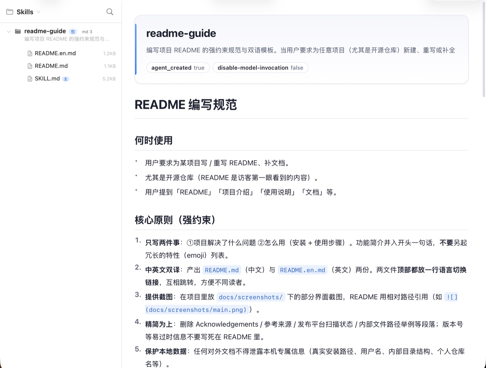
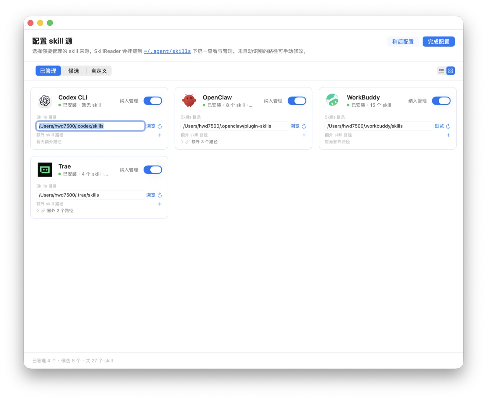

# Skill Reader · 技能阅读与管理器

[🇨🇳 中文](README.md) · [🇺🇸 English](README.en.md)

一个本地优先的 **skill 包阅读器与管理器**：浏览本机技能库（`SKILL.md` + `references/` + `scripts/`），
Markdown 渲染阅读；并让纳入管理的 skill 在多个 Agent（Claude Code / OpenClaw / WorkBuddy …）之间共享。

原生 macOS 桌面应用（SwiftUI + WKWebView），双击即用，无需浏览器与后端服务。

## 为什么需要它

每个 AI Agent 都有自己的「技能包」（skill）——一个带 `SKILL.md` 的文件夹，
附上 `references/`（参考文档）、`scripts/`（脚本）、`assets/`（模板）。
`SKILL.md` 是写给 Agent 看的操作手册：平时只有 description 常驻上下文，
说中触发词才把正文加载进来（渐进式加载）。想优化 skill、让 Agent 少走弯路，就得先读懂它——可现实中：

- **埋得深**：skill 藏在各 Agent 层层包裹的隐藏目录（`~/.claude/skills`、`~/.workbuddy/skills`……），想预览、想编辑，光「找到它」这一步就够费劲；
- **没法读**：终端 `cat` 出来的是原始 Markdown，frontmatter、目录、代码块全糊在一起；
- **没法共享**：同一个 skill 想让多个 Agent 用，只能复制粘贴——改了一处忘了另一处，版本悄悄漂移。

SkillReader 就是为这三件事生的。

## 能做什么

> **两大核心**：SkillReader 只把两件事做到位——**📖 阅读**你的 skill 源码，**🔗 共享**给所有 Agent。下面两张真实界面截图，正好对应这两项核心能力。

### 📖 阅读

- 识别 skill 包（含 `SKILL.md` 的目录，或独立 `.md` 文件），显示描述与 md/py 文件统计
- 树形浏览包内结构：`references/` 子文档、`scripts/` 脚本、`assets/` 资源，主文档带「主」标记
- Markdown 渲染阅读：YAML frontmatter 卡片、代码高亮、右侧目录大纲（滚动跟随）
- 脚本高亮查看：`.py` 等代码文件带行号、选中复制
- 图片 / PDF / JSON / YAML 直接预览
- 阅读 / 源码模式切换（`⌘/`）
- 页内查找（`Cmd+F`）：关键词命中全部高亮，回车逐条跳转
- 技能名/描述/内容全局搜索；一键在 Finder 中定位文件
- `⌘E` 在系统默认编辑器（VSCode、Typora 等）中打开当前文件，改完即存即生效

<p align="center">
  
</p>

### 🔗 共享 skills（Agent 互通 · 单一真相源）

- 以 `~/.agent/library` 为中心库（唯一真相源）。纳入某 Agent 时，其全部真实 skill 自动「采纳」进中心库，原目录替换为指向中心库的 symlink——来源 Agent 自己、以及分发到的其它 Agent，全部指向同一份，改一处全局生效
- 中心库条目以 `<ownerAgentId>__<skillName>` 命名（如 `claude-code__ego-browser`），跨 Agent 同名 skill 互不覆盖、各自独立分发
- 也可右键某 skill → 「复制到中心库并分发…」手动导入并勾选目标 Agent；顶栏「同步」按钮随时重建分发
- 采纳前原真实目录整体移入 `~/.agent/backups/<agentId>/` 可恢复；除采纳外，应用只清理「自己建的、指向中心库」的链接，绝不覆盖或删除各 Agent 自行安装的 skill

配置页内置探测 12 个常见 Agent（Claude Code、WorkBuddy、OpenClaw、Codex CLI、Gemini CLI、Trae、QoderWork、Kimi Code 等），装了几个认出几个；
不在名单里的 Agent 支持**自定义添加**——把 skill 文件夹直接拖进配置页，或点虚线框选择文件夹，自动递归识别其中全部 skill。

<p align="center">
  
</p>


## 安装

构建产物为 `SkillReader.app`，拖入「应用程序」文件夹，双击即可使用（首次启动右键 → 打开）。

源码构建：

```bash
cd SkillReaderApp
./scripts/build_app.sh
open /Applications/SkillReader.app
```

构建依赖：macOS 14+，Xcode Command Line Tools（含 Swift 6）。

## 使用

1. 首次启动完成 Agent 配置（勾选本机已安装的 Agent 纳入管理），阅读器自动挂载其技能库
2. 左侧点击技能名展开文件树，自动打开 `SKILL.md`；点击任一文件切换查看
3. 顶栏搜索框：输入即过滤技能列表，回车进行内容全局搜索
4. 右键某 skill → 「互通：复制到中心库并分发…」：先导入中心库，再勾选要共享的 Agent
5. 「分发到平台」面板保存即生效；顶栏「同步」按钮可随时重建分发
6. 代码文件右上角「复制代码」一键复制全文；「定位文件」在 Finder 中显示
7. `Esc` 从子文件快速返回当前技能的主文档

## 主题

系统蓝主题，跟随系统自动切换浅色 / 深色模式；代码块在浅色模式下也呈现深色高亮，阅读更聚焦。

## 数据安全

应用对「中心库」与「各 Agent 分发目录」仅做符号链接级别的写入，**不会复制或覆盖**任何 Agent 自带的 skill 内容；
纯文件 IO、不 spawn 任何进程，不影响各 Agent 自身运行。

## 开发

```bash
cd SkillReaderApp
swift build                          # 编译
.build/debug/SkillReader --self-test # 数据层自测（79 项断言）
.build/debug/SkillReader --render-smoke  # 渲染链路自测
```

## License

MIT
